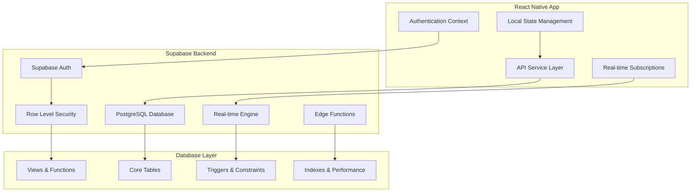

# Design Document

## Overview

This design document outlines the complete Supabase database integration for the Serrano Tex Inventory Management System. The solution implements a PostgreSQL database with 19+ core tables, comprehensive Row Level Security (RLS), real-time subscriptions, and seamless React Native integration.

**Key Design Principles:**
- **Security First**: RLS policies enforce role-based access at the database level
- **Real-time Updates**: Supabase real-time subscriptions for live data synchronization
- **Performance Optimized**: Proper indexing, views, and query optimization
- **Scalable Architecture**: Designed to handle business growth and increased load
- **Data Integrity**: Comprehensive constraints, triggers, and validation

## Architecture

### High-Level Architecture



### Database Architecture

The database follows a normalized design with clear separation of concerns:

1. **User Management Layer**: Users, roles, permissions, and authentication
2. **Master Data Layer**: Categories, suppliers, customers, locations
3. **Product Management Layer**: Products, stock items, lots, and inventory
4. **Transaction Layer**: Sales, purchases, transfers, and payments
5. **Analytics Layer**: Reports, activity logs, and business intelligence
6. **System Layer**: Notifications, settings, and system management

## Components and Interfaces

### 1. Database Schema Components

#### Core Tables Structure

```sql
-- User Management
users (19 columns) -> Role-based access control
user_permissions -> Granular permissions

-- Master Data
categories (12 columns) -> Product categorization
suppliers (20 columns) -> Supplier management
customers (25 columns) -> Customer relationship management
locations (15 columns) -> Multi-location inventory

-- Product Management
products (30 columns) -> Product catalog
stock_items (18 columns) -> Location-based inventory
product_lots (15 columns) -> FIFO lot tracking

-- Transactions
sales (25 columns) -> Sales management
sale_items (15 columns) -> Sale line items
purchases (22 columns) -> Purchase orders
purchase_items (18 columns) -> Purchase line items
transfers (20 columns) -> Inter-location transfers

-- Financial Management
payments (18 columns) -> Payment tracking
customer_dues (15 columns) -> Customer outstanding amounts
supplier_dues (14 columns) -> Supplier payments

-- Operations
samples (25 columns) -> Sample tracking
wastage (20 columns) -> Wastage management

-- System
activity_logs (18 columns) -> Audit trail
notifications (16 columns) -> System notifications
```

#### ENUM Types

```sql
-- User and Role Management
CREATE TYPE user_role AS ENUM ('super_admin', 'admin', 'sales_manager', 'investor');
CREATE TYPE payment_status_enum AS ENUM ('good', 'warning', 'overdue', 'red_listed');

-- Business Operations
CREATE TYPE location_type_enum AS ENUM ('warehouse', 'showroom');
CREATE TYPE customer_type_enum AS ENUM ('vip', 'regular', 'wholesale');
CREATE TYPE supplier_type_enum AS ENUM ('manufacturer', 'distributor', 'wholesaler', 'retailer');

-- Transaction Management
CREATE TYPE sale_status_enum AS ENUM ('draft', 'completed', 'cancelled', 'returned', 'refunded');
CREATE TYPE payment_method_enum AS ENUM ('cash', 'card', 'bank_transfer', 'check', 'online', 'credit');
CREATE TYPE transfer_status_enum AS ENUM ('pending', 'approved', 'rejected', 'in_transit', 'completed', 'cancelled');

-- System Operations
CREATE TYPE notification_type_enum AS ENUM ('due_reminder', 'low_stock', 'transfer_request', 'system_alert');
CREATE TYPE action_type_enum AS ENUM ('CREATE', 'UPDATE', 'DELETE', 'LOGIN', 'LOGOUT', 'VIEW', 'APPROVE');
```

### 2. Row Level Security (RLS) Design

#### Security Policy Framework

```sql
-- Super Admin: Full access to all data
CREATE POLICY "super_admin_full_access" ON {table_name}
    FOR ALL USING (
        EXISTS (
            SELECT 1 FROM users 
            WHERE id = auth.uid() AND role = 'super_admin'
        )
    );

-- Admin: Configurable permissions based on assigned permissions
CREATE POLICY "admin_permission_based" ON {table_name}
    FOR SELECT USING (
        EXISTS (
            SELECT 1 FROM users u
            JOIN user_permissions up ON u.id = up.user_id
            WHERE u.id = auth.uid() 
            AND u.role = 'admin'
            AND up.module = '{module_name}'
            AND up.action = 'view'
            AND up.status = 'active'
        )
    );

-- Sales Manager: Location-restricted access
CREATE POLICY "sales_manager_location_access" ON {table_name}
    FOR SELECT USING (
        EXISTS (
            SELECT 1 FROM users u
            WHERE u.id = auth.uid() 
            AND u.role = 'sales_manager'
            AND (u.assigned_locations::jsonb ? location_id::text)
        )
    );

-- Investor: Read-only dashboard access
CREATE POLICY "investor_readonly_access" ON {table_name}
    FOR SELECT USING (
        EXISTS (
            SELECT 1 FROM users 
            WHERE id = auth.uid() 
            AND role = 'investor'
        )
    );
```

### 3. API Service Layer Design

#### Service Architecture

```typescript
// Base API Service
class SupabaseService {
  private supabase: SupabaseClient;
  
  constructor() {
    this.supabase = createClient(SUPABASE_URL, SUPABASE_ANON_KEY);
  }
  
  // Generic CRUD operations with RLS
  async create<T>(table: string, data: Partial<T>): Promise<T>;
  async read<T>(table: string, query?: QueryBuilder): Promise<T[]>;
  async update<T>(table: string, id: string, data: Partial<T>): Promise<T>;
  async delete(table: string, id: string): Promise<void>;
  
  // Real-time subscriptions
  subscribe<T>(table: string, callback: (data: T) => void): RealtimeSubscription;
}

// Specialized Services
class ProductService extends SupabaseService {
  async getProducts(filters?: ProductFilters): Promise<Product[]>;
  async updateStock(productId: string, quantity: number): Promise<void>;
  async getStockStatus(productId: string): Promise<StockStatus>;
}

class SalesService extends SupabaseService {
  async createSale(saleData: CreateSaleRequest): Promise<Sale>;
  async processPayment(saleId: string, payment: PaymentData): Promise<void>;
  async generateInvoice(saleId: string): Promise<string>;
}

class InventoryService extends SupabaseService {
  async transferStock(transferRequest: TransferRequest): Promise<Transfer>;
  async approveTransfer(transferId: string): Promise<void>;
  async getLocationStock(locationId: string): Promise<StockItem[]>;
}
```

### 4. Real-time Integration Design

#### Subscription Management

```typescript
class RealtimeManager {
  private subscriptions: Map<string, RealtimeSubscription> = new Map();
  
  // Subscribe to table changes with RLS filtering
  subscribeToTable<T>(
    table: string, 
    filter: string,
    callback: (payload: RealtimePayload<T>) => void
  ): string {
    const subscription = supabase
      .channel(`${table}_changes`)
      .on('postgres_changes', 
        { event: '*', schema: 'public', table, filter },
        callback
      )
      .subscribe();
    
    const subscriptionId = `${table}_${Date.now()}`;
    this.subscriptions.set(subscriptionId, subscription);
    return subscriptionId;
  }
  
  // Unsubscribe from changes
  unsubscribe(subscriptionId: string): void {
    const subscription = this.subscriptions.get(subscriptionId);
    if (subscription) {
      subscription.unsubscribe();
      this.subscriptions.delete(subscriptionId);
    }
  }
}

// Usage in React Native components
const useRealtimeData = <T>(table: string, filter?: string) => {
  const [data, setData] = useState<T[]>([]);
  const [loading, setLoading] = useState(true);
  
  useEffect(() => {
    const subscriptionId = realtimeManager.subscribeToTable(
      table,
      filter || '',
      (payload) => {
        // Handle real-time updates
        handleRealtimeUpdate(payload);
      }
    );
    
    return () => realtimeManager.unsubscribe(subscriptionId);
  }, [table, filter]);
  
  return { data, loading };
};
```

## Data Models

### Core Entity Models

#### User Management

```typescript
interface User {
  id: string;
  full_name: string;
  email: string;
  phone?: string;
  role: 'super_admin' | 'admin' | 'sales_manager' | 'investor';
  permissions: UserPermissions;
  assigned_locations: string[];
  profile_picture_url?: string;
  is_active: boolean;
  last_login?: Date;
  created_by?: string;
  created_at: Date;
  updated_at: Date;
}

interface UserPermissions {
  dashboard: boolean;
  products: ModulePermissions;
  inventory: ModulePermissions;
  sales: ModulePermissions;
  customers: ModulePermissions;
  suppliers: ModulePermissions;
  samples: ModulePermissions;
  reports: ModulePermissions;
  notifications: ModulePermissions;
  settings: ModulePermissions;
}

interface ModulePermissions {
  view: boolean;
  add: boolean;
  edit: boolean;
  delete: boolean;
  approve?: boolean;
  export?: boolean;
}
```

#### Product and Inventory

```typescript
interface Product {
  id: string;
  name: string;
  product_code: string;
  category_id: string;
  description?: string;
  purchase_price: number;
  selling_price: number;
  yard_price?: number;
  current_stock: number;
  available_stock: number;
  reserved_stock: number;
  minimum_threshold: number;
  supplier_id?: string;
  primary_location_id?: string;
  is_active: boolean;
  is_unsold: boolean;
  last_sold_date?: Date;
  wastage_amount: number;
  image_url?: string;
  created_by: string;
  created_at: Date;
  updated_at: Date;
}

interface StockItem {
  id: string;
  product_id: string;
  location_id: string;
  lot_number: string;
  purchase_date: Date;
  initial_quantity: number;
  current_quantity: number;
  reserved_quantity: number;
  available_quantity: number; // Generated column
  purchase_price: number;
  supplier_id?: string;
  minimum_threshold: number;
  status: 'active' | 'depleted' | 'expired' | 'damaged';
  created_at: Date;
  updated_at: Date;
}
```

#### Sales and Financial

```typescript
interface Sale {
  id: string;
  invoice_number: string;
  customer_id: string;
  location_id: string;
  sale_date: Date;
  subtotal: number;
  discount_amount: number;
  tax_amount: number;
  total_amount: number;
  payment_method: PaymentMethod;
  paid_amount: number;
  remaining_amount: number; // Generated column
  due_date?: Date;
  delivery_person_name?: string;
  delivery_person_phone?: string;
  sale_status: SaleStatus;
  payment_status: PaymentStatus;
  sold_by: string;
  notes?: string;
  created_at: Date;
  updated_at: Date;
}

interface SaleItem {
  id: string;
  sale_id: string;
  product_id: string;
  stock_item_id: string;
  lot_number: string;
  quantity: number;
  unit_price: number;
  discount_amount: number;
  tax_amount: number;
  line_total: number;
  product_name: string; // Snapshot at time of sale
  product_code: string; // Snapshot at time of sale
  created_at: Date;
  updated_at: Date;
}
```

## Error Handling

### Database Error Handling Strategy

```typescript
class DatabaseError extends Error {
  constructor(
    message: string,
    public code: string,
    public details?: any
  ) {
    super(message);
    this.name = 'DatabaseError';
  }
}

class APIService {
  private handleError(error: any): never {
    // Supabase specific error handling
    if (error.code === 'PGRST116') {
      throw new DatabaseError('No rows found', 'NOT_FOUND');
    }
    
    if (error.code === '23505') {
      throw new DatabaseError('Duplicate entry', 'DUPLICATE_KEY', error.details);
    }
    
    if (error.code === '42501') {
      throw new DatabaseError('Insufficient permissions', 'PERMISSION_DENIED');
    }
    
    // RLS policy violations
    if (error.message.includes('row-level security')) {
      throw new DatabaseError('Access denied by security policy', 'RLS_VIOLATION');
    }
    
    // Generic database error
    throw new DatabaseError(error.message || 'Database operation failed', 'DATABASE_ERROR', error);
  }
  
  async executeQuery<T>(operation: () => Promise<T>): Promise<T> {
    try {
      return await operation();
    } catch (error) {
      this.handleError(error);
    }
  }
}
```

### React Native Error Boundaries

```typescript
class DatabaseErrorBoundary extends React.Component {
  state = { hasError: false, error: null };
  
  static getDerivedStateFromError(error: Error) {
    if (error instanceof DatabaseError) {
      return { hasError: true, error };
    }
    return null;
  }
  
  componentDidCatch(error: Error, errorInfo: React.ErrorInfo) {
    if (error instanceof DatabaseError) {
      // Log to analytics service
      Analytics.logError('database_error', {
        code: error.code,
        message: error.message,
        details: error.details
      });
    }
  }
  
  render() {
    if (this.state.hasError) {
      return <DatabaseErrorScreen error={this.state.error} />;
    }
    
    return this.props.children;
  }
}
```

## Testing Strategy

### Database Testing Approach

#### 1. Schema Testing
- **Migration Testing**: Verify all migrations run successfully
- **Constraint Testing**: Test all database constraints and validations
- **RLS Testing**: Verify security policies work correctly for each role
- **Performance Testing**: Test query performance with realistic data volumes

#### 2. API Integration Testing
- **CRUD Operations**: Test all create, read, update, delete operations
- **Real-time Subscriptions**: Test real-time data synchronization
- **Error Handling**: Test error scenarios and recovery
- **Authentication**: Test role-based access control

#### 3. End-to-End Testing
- **User Workflows**: Test complete business processes
- **Data Consistency**: Verify data integrity across operations
- **Concurrent Access**: Test multiple users accessing data simultaneously
- **Offline/Online Sync**: Test data synchronization scenarios

### Testing Infrastructure

```typescript
// Test Database Setup
class TestDatabaseManager {
  private testSupabase: SupabaseClient;
  
  async setupTestDatabase(): Promise<void> {
    // Create test database instance
    this.testSupabase = createClient(TEST_SUPABASE_URL, TEST_SUPABASE_KEY);
    
    // Run migrations
    await this.runMigrations();
    
    // Seed test data
    await this.seedTestData();
  }
  
  async cleanupTestDatabase(): Promise<void> {
    // Clean up test data
    await this.truncateAllTables();
  }
  
  async seedTestData(): Promise<void> {
    // Create test users with different roles
    await this.createTestUsers();
    
    // Create test products and inventory
    await this.createTestProducts();
    
    // Create test customers and suppliers
    await this.createTestMasterData();
  }
}

// RLS Policy Testing
describe('Row Level Security', () => {
  test('Super Admin can access all data', async () => {
    const { data, error } = await supabase
      .from('products')
      .select('*');
    
    expect(error).toBeNull();
    expect(data).toBeDefined();
  });
  
  test('Sales Manager can only access assigned location data', async () => {
    // Test location-restricted access
    const { data, error } = await supabase
      .from('stock_items')
      .select('*')
      .eq('location_id', 'assigned_location_id');
    
    expect(error).toBeNull();
    expect(data.every(item => item.location_id === 'assigned_location_id')).toBe(true);
  });
  
  test('Investor has read-only access', async () => {
    const { error } = await supabase
      .from('products')
      .insert({ name: 'Test Product' });
    
    expect(error).toBeDefined();
    expect(error.code).toBe('42501'); // Insufficient privileges
  });
});
```

## Performance Considerations

### Database Optimization

#### Indexing Strategy
```sql
-- Primary performance indexes
CREATE INDEX CONCURRENTLY idx_products_category_active ON products(category_id, is_active);
CREATE INDEX CONCURRENTLY idx_stock_items_product_location ON stock_items(product_id, location_id);
CREATE INDEX CONCURRENTLY idx_sales_date_location ON sales(sale_date, location_id);
CREATE INDEX CONCURRENTLY idx_customers_type_active ON customers(customer_type, is_active);

-- Search optimization indexes
CREATE INDEX CONCURRENTLY idx_products_search ON products USING gin(to_tsvector('english', name || ' ' || product_code));
CREATE INDEX CONCURRENTLY idx_customers_search ON customers USING gin(to_tsvector('english', name || ' ' || phone));

-- Partial indexes for common queries
CREATE INDEX CONCURRENTLY idx_products_low_stock ON products(current_stock) WHERE current_stock <= minimum_threshold;
CREATE INDEX CONCURRENTLY idx_customers_red_listed ON customers(id) WHERE is_red_listed = true;
```

#### Query Optimization Views
```sql
-- Product stock summary view
CREATE VIEW vw_product_stock_summary AS
SELECT 
    p.id,
    p.name,
    p.product_code,
    c.name as category_name,
    p.current_stock,
    p.minimum_threshold,
    CASE 
        WHEN p.current_stock = 0 THEN 'Out of Stock'
        WHEN p.current_stock <= p.minimum_threshold THEN 'Low Stock'
        ELSE 'In Stock'
    END as stock_status,
    COUNT(si.id) as location_count,
    SUM(si.current_quantity) as total_quantity
FROM products p
JOIN categories c ON p.category_id = c.id
LEFT JOIN stock_items si ON p.id = si.product_id
WHERE p.is_active = true
GROUP BY p.id, p.name, p.product_code, c.name, p.current_stock, p.minimum_threshold;

-- Sales analytics view
CREATE VIEW vw_sales_analytics AS
SELECT 
    DATE_TRUNC('day', s.sale_date) as sale_date,
    l.name as location_name,
    l.location_type,
    COUNT(s.id) as transaction_count,
    SUM(s.total_amount) as total_revenue,
    AVG(s.total_amount) as average_order_value,
    SUM(s.paid_amount) as total_paid,
    SUM(s.remaining_amount) as total_outstanding
FROM sales s
JOIN locations l ON s.location_id = l.id
WHERE s.sale_status = 'completed'
GROUP BY DATE_TRUNC('day', s.sale_date), l.name, l.location_type;
```

### React Native Performance

#### Data Loading Optimization
```typescript
// Implement pagination for large datasets
class PaginatedDataLoader<T> {
  private pageSize = 20;
  private currentPage = 0;
  
  async loadPage(table: string, filters?: any): Promise<T[]> {
    const { data, error } = await supabase
      .from(table)
      .select('*')
      .match(filters || {})
      .range(this.currentPage * this.pageSize, (this.currentPage + 1) * this.pageSize - 1)
      .order('created_at', { ascending: false });
    
    if (error) throw error;
    
    this.currentPage++;
    return data;
  }
}

// Implement optimistic updates
class OptimisticUpdateManager {
  async updateWithOptimism<T>(
    table: string,
    id: string,
    updates: Partial<T>,
    optimisticUpdate: (data: T[]) => T[]
  ): Promise<T> {
    // Apply optimistic update immediately
    const currentData = getCurrentData<T>(table);
    const optimisticData = optimisticUpdate(currentData);
    updateLocalState(table, optimisticData);
    
    try {
      // Perform actual update
      const { data, error } = await supabase
        .from(table)
        .update(updates)
        .eq('id', id)
        .select()
        .single();
      
      if (error) throw error;
      
      // Update with real data
      updateLocalState(table, data);
      return data;
    } catch (error) {
      // Revert optimistic update on error
      updateLocalState(table, currentData);
      throw error;
    }
  }
}
```

This comprehensive design provides a solid foundation for implementing the Supabase database integration with proper security, performance, and scalability considerations.